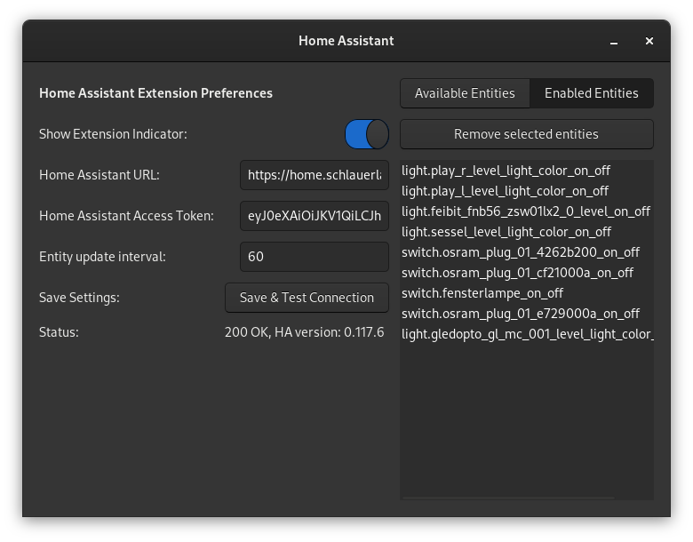
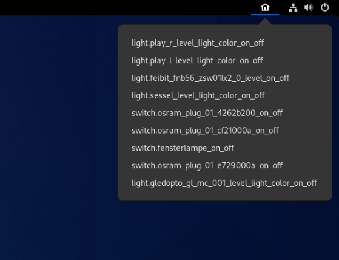

# Gnome Shell Extension for Home Assistant

A Gnome Shell Extension to interact with the Home Assistant API

I was supprised to see that there was no home assistant extension already.
So i made one.
If you have any feedback feel free to send it to me!

> Tested & working on Fedora 33 with Gnome 3.38.1
> 
> But this is still in alpha, use at own risk.

## Usage

- Open settings and insert your Home Assistant URL
- Create a long lived access token in Home Assistant and paste in Settings.
- Click "Save & Test Connection"
- Select Entities in the "Available Entities" Panel and click "Add Entities"

## Functionality

- Toggle light and switch entities on and off from the gnome status bar
- Activate Scenes
- Add and remove entities in the settings

## Todos

- [x] Update the lists automatically
- [x] Show friendly names instead of entity id
- [x] Add Scenes
- [ ] Show entity state inside indicator
- [ ] Show icons in indicator
- [ ] Add "Open Settings" menu item
- [ ] Add "Open Home Assistant Web UI" menu item
- [ ] Sortable "enabled entities" list
- [ ] Searchable / filterable "all entities" list
- [ ] Select multiple entites from available / enabled entities
- [ ] Add configurable services
- [ ] Show Notifications?
- [ ] Use glade template for UI
- [ ] Seperate api request to function
- [ ] Remove enabled entities from all entities list

## Feedback

Feel free to send feedback and/or issues

## Note

This Project is not affiliated or endorsed in any way by Home Assistant.
