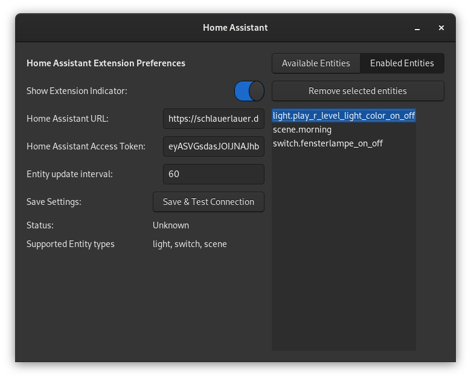

# Gnome Shell Extension for Home Assistant

A Gnome Shell Extension to interact with the Home Assistant API.

You can activate scenes and toggle lights and switches!

> Tested & working on Fedora 33 with Gnome 3.38.1

## Functionality

- Toggle light and switch entities on and off from the gnome status bar
- Activate Scenes
- Add and remove entities in the settings

## Usage

- Open settings and insert your Home Assistant URL
- Create a long lived access token in Home Assistant and paste in Settings.
- Click "Save & Test Connection"
- Select Entities in the "Available Entities" Panel and click "Add Entities"

## Installation

### Install from [extensions.gnome.org](https://extensions.gnome.org)

> Extension pending

### Manual install

1. `git clone https://gitlab.com/schlauerlauer/gnome-shell-home-assistant.git`
2. `cd gnome-shell-home-assistant/homeassistant@schlauerlauer.de`
3. `zip -r homeassistant@schlauerlauer.de.zip . --exclude=.git/\* --exclude=*.sh --exclude=*.zip`
4. `gnome-extensions install homeassistant@schlauerlauer.de.zip`
5. `gnome-extensions enable homeassistant@schlauerlauer.de`
6. Reload Gnome Shell
   - On X11 press `Alt+F2`, Type in `r` and press `Enter`
   - On Wayland Log out & Log in

## Todos

> see Issues

- [ ] Subscribe to custom events
- [ ] Add configurable services

## Feedback

Feel free to send feature requests and open issues
